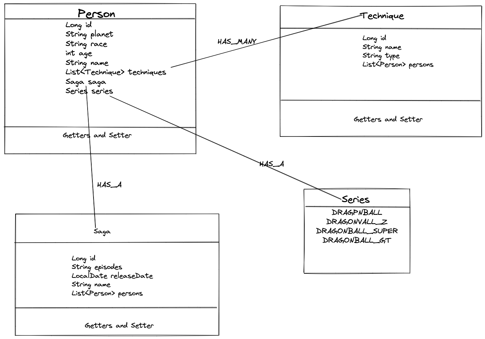
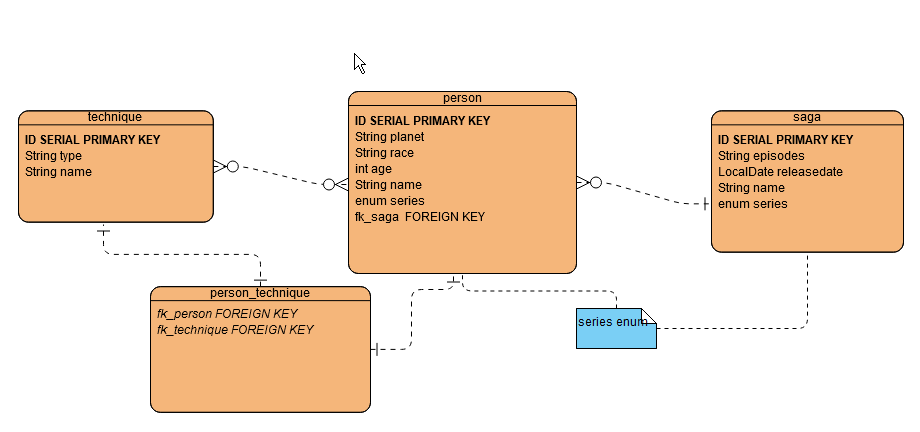

# Dragon Ball API
[//]: # ()

This API features:
1. A Many-To-Many and One-To-Many relationship **(see diagrams)**
2. Full CRUD functionality
3. Derived queries for multiple end-points **(see list)**

### Class Diagram

### Entity Diagram

### Endpoints
1. Display all characters with this name(Ignores caps):  
loclahost:8080/persons?name=***type a name***
2. Display all ...